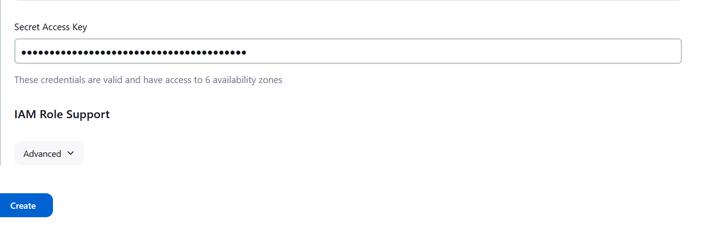

# Build and push Docker Image to AWS ECR

Here we will be adding to the jenkins pipeline, the code for docker build creating a docker image and pushing it to AWS Elastic Container Registry(ECR)

#### 1. Create Docker login credentials in jenkins

Jenkins Dashboard -> Manage Jenkins -> credentials -> Stores -> scoped to Jenkins -> System -> Global credentials -> Add credentials

Please note we will be giving dockerhub credentials.

#### 2. Create AWS ECR 

AWS Dashboard -> Elastic Container Registry -> Get Started(Create Repository) -> Private-> RepositoryName -> Create Repository
RepositoryName = easyuggyapp

#### 3. Create AWS credentials in Jenkins

Jenkins Dashboard -> Manage Jenkins -> credentials -> Stores -> scoped to Jenkins -> System -> Global credentials -> Add credentials

The Access ID and secret key here will be your AWS access id and secret key.

#### 4. Jenkins file

Add stages to the existing Jenkins file

#### 5. Create the pipeline job and configure

#### 6. Build the job

#### 7. Validate ECR

